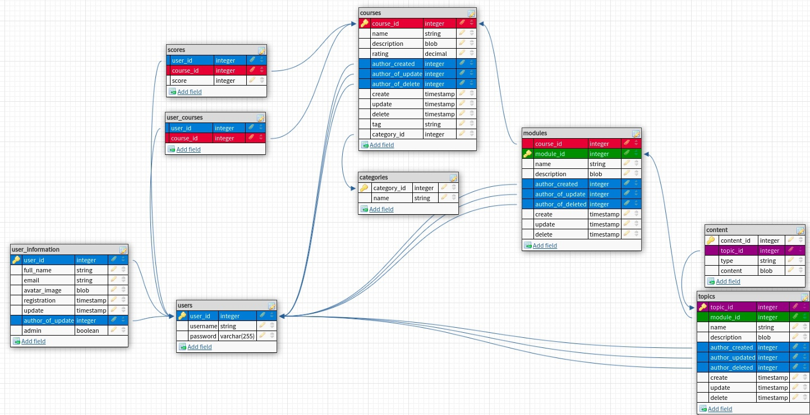

# БД:
 \n
Основные запросы:
1. Авторизация: SELECT password FROM users WHERE user_id = ?
2. Все курсы: SELECT * FROM courses ORDER BY rating DESC. Индекс на таблицу: CREATE INDEX idx_courses_title ON courses USING btree title; CREATE INDEX idx_courses_rating ON courses USING btree rating, CREATE INDEX idx_courses_category ON courses USING btree category
3. Курсы пользователя: SELECT * FROM coures WHERE course_id IN ( SELECT course_id FROM users_courses WHERE user_id = ?) 
4. Модули курса: SELECT * FROM modules WHERE course_id = ? Индекс: CREATE INDEX idx_modules ON modules USING btree name; CREATE INDEX idx_modules ON modules USING btree author_create; CREATE INDEX idx_modules ON modules USING btree name. Возможно стоит сделать и на course_id (т.к. курсов не так много, как модулей по отношению к топикам)
5. Топики модуля: SELECT * FROM topics WHERE module_id = ? Индексы на таблицу topics аналогичные как для предыдущей
6. Добавление курса пользователем к себе: INSERT INTO users_courses VALUES(?, ?)
7. Создание топика: INSERT INTO topics VALUES(?,...,?)

